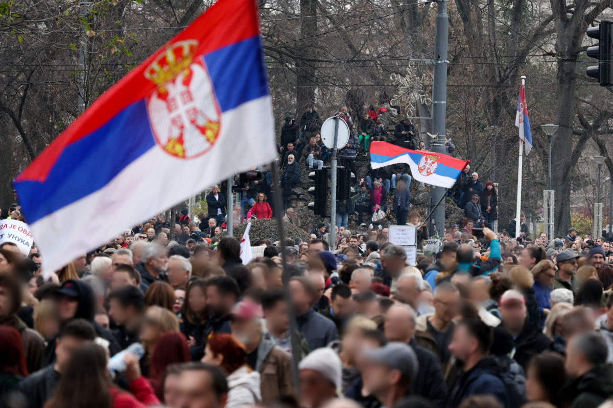
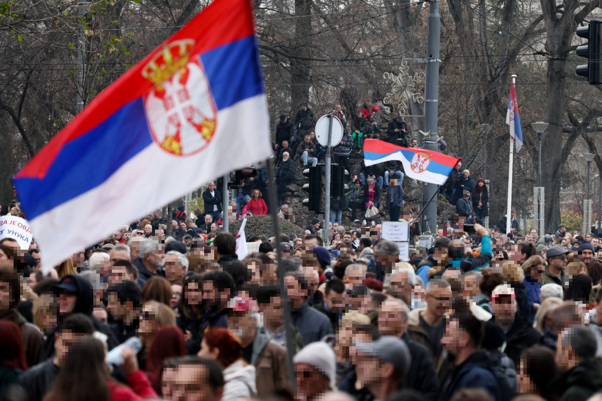
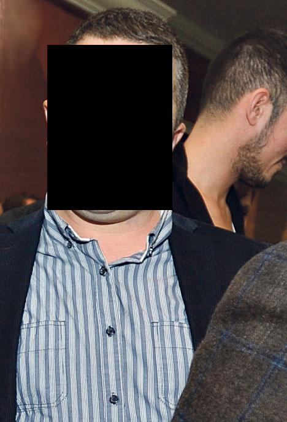

  

---
In-browser face anonymizer with **Blur**, **Pixelate**, and **Box** modes

Built to be an easy, ad-free tool after members of my community in Belgrade were identified and arrested because of carelessly shared protest photos. Runs entirely in-browser, no images leave your device

### Blur
**Crowd**
| Original | Blur |
|----------|------|
|  |  |

**Individual**
| Original | Blur |
|----------|------|
|  |  |

---

### Pixelate
| Original | Pixelate |
|----------|----------|
|  |  |

---

### Box
**Individual**
| Original | Box |
|----------|-----|
|  |  |

---

- [**face-api.js**](https://github.com/justadudewhohacks/face-api.js)
- **Tiny Face Detector** and **SSD MobileNet v1**
